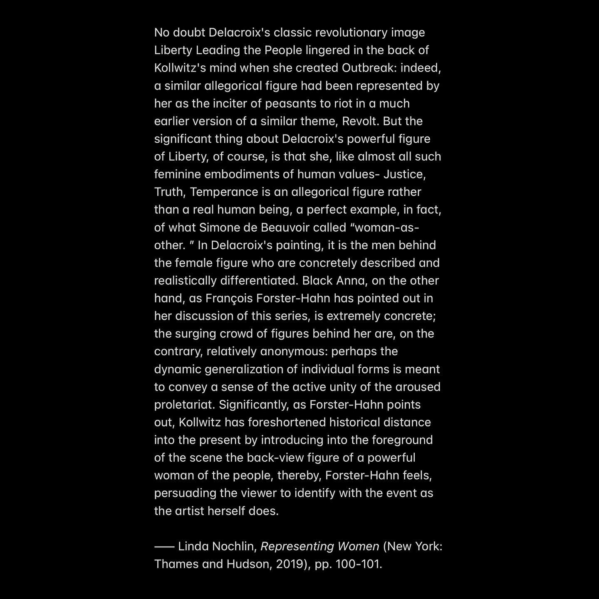
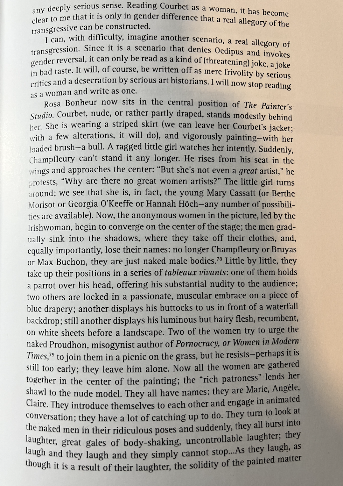
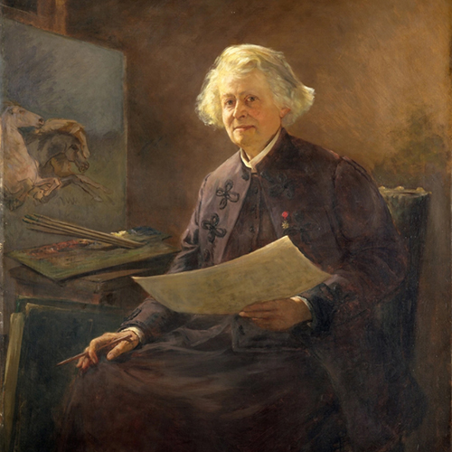
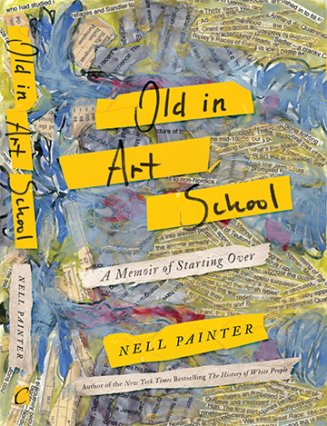
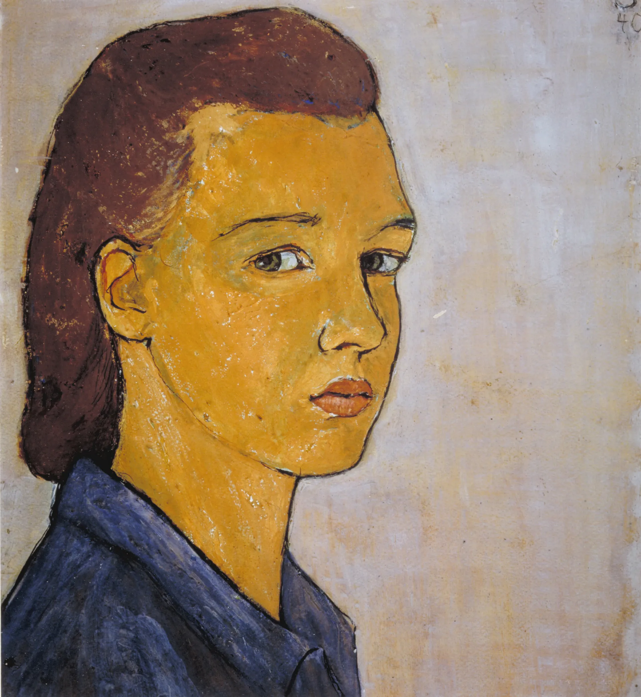
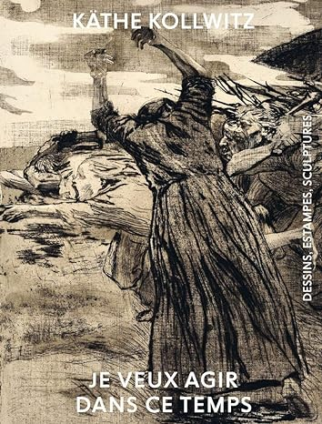
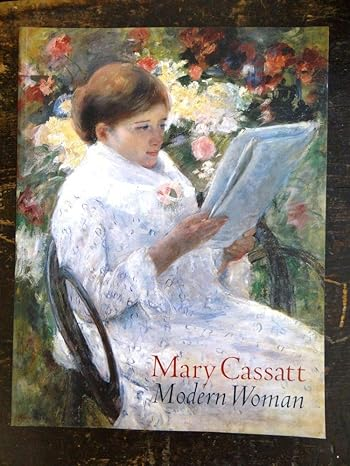

+++
title = "Art HERstory —— 女性相关艺术类书籍分享"
summary = " "
image = "images/cover.png"
categories = [
    "戒读所",
]
tags = [
    "读书",  
    "女权"                           
]
date = "2023-11-10"
menu = "main"
+++

### **Representing Women**
*Linda Nochlin*
 
https://neodb.social/book/3FUORbFtOdHoNM9D599iAO

从女性视角解读传统艺术作品中的女性形象（或者女性的缺席）。作者是女性艺术史学者Linda Nochlin，也是 *Why Have There Been No Great Women Artists?* 这篇文章的作者。

我很喜欢第一章*The Myth of the Woman Warrior*，这一章对比了男女创作者笔下对革命和战争中女性形象的不同呈现，和当下的联系非常紧密，也很好地说明了为社么很多女权主义者觉得名画「自由引导人民」中的女性形象并不适合作为“白纸运动”的代表形象：
<figure>
    
<figure>

第四章里从女性视角出发对男性笔下的*Painter’s Studio*的重新想象也非常犀利有趣，在这里女性不再是男画家的缪斯、模特或崇拜者，而是创作者本身：
<figure>
    
<figure>

### **Art Is a Tyrant: The Unconventional Life of Rosa Bonheur**
*Catherine Hewitt*
 
https://neodb.social/book/1dCV6WLSVSLR7Indb5RUdq

在上面Nochlin的想象中出现的19世纪法国女画家Rosa Bonheur的传记。

Rosa Bonheur擅长以动物为主题的创作，虽然现在似乎知名度不高，但她在世时其实获得了很高的成就，不论是在艺术界还是普通民众之间都很受欢迎。她的个人生活在当时也是非常“反传统”，终生未婚并且先后与两位女性伴侣共同生活。

<figure>
    
    <figcaption>由Rosa Bonheur晚年的伴侣Anna Klumpke于1898创作的肖像</figcaption>
<figure>
这本书文笔上不是很精彩，给人的感觉有点像流水账，但确实对Rosa Bonheur的生平做了一个比较详细且全面的介绍。很难想象她在自己的时代取得了那样的成就，在后世却几乎无人问津，所以我会觉得这些重新发现被遗忘的女性艺术家的作品即便没有什么文学性也是值得去读的。但每次了解到伟大女性的生平（尤其是有一定年代的）都会更深地意识到，即便是为女权和女性地位的提升、处境的改善做出了实际贡献的人——不管是主动还是无心插柳——也免不了“厌女”情结以及在一定程度上配合父权制（虽然这也不能怪她们···），另外也觉得她能在专业上取得这样的成就，很大程度上是因为有其他的女性在她的生活中扮演了wife的角色···

### **Seeing Ourselves**
*Frances Borzello*
 
https://neodb.social/book/2e4gqhPQvMlgpLtwG1B8LH

以下是豆瓣对[中文版](https://book.douban.com/subject/30233944/)的简介：
> 这部女性自画像文化史内容丰富，用五彩缤纷、令人见之难忘的作品展示了女性艺术家们那极富创造力、精彩又凄美的创作思路和艺术表现——仿佛修女们穿越了几百年的岁月，自书页间凝望着我们；16世纪的意大利，索弗尼斯瓦·安古索拉画下了漫长的自画像系列之一——从豆蔻年华直至垂垂暮年；17世纪的荷兰，朱迪丝·莱斯特笔下的自己坐在画架前，描绘了一位淡定从容、成竹在胸的专业人士；18世纪，从伊丽莎白·维吉-勒布朗到安吉利卡·考夫曼，艺术家们表达了对于自身行业的热枕，也体现了她们关于女性气质的理念......这部发人深省的著作充分展现了弗朗西斯·波泽罗扣人心弦的文字和饱含感情、令人沉醉的自画像插图。

这本书让我知道了许多以前没有听过的女画家，包括擅长创作“杀男人”题材的Artemisia Gentileschi，她的遭遇看得我忍不住在旁边批注WTF···
<figure>
    
<figure>

### **Old in Art School: A Memoir of Starting Over**
[*Nell Painter*](http://www.nellpainter.com/)
 
https://neodb.social/book/2Q3LhXP81qdA1EvsgeelPW

<figure>
    
<figure>

退休历史教授重回校园成为大一艺术新生的故事；作者写出了自己在创作过程中的自我怀疑、作为一个有历史学背景和学术成就的老年黑人女性对艺术界与艺术（“**Art with a capital A**”）本身的质疑与思考，其中还夹杂着作者与父母之间的关系以及多重身份下的挣扎与探索，一些地方让人很有共鸣。

### **Methods & Theories of Art History**
*Anne D'Alleva*
 
https://neodb.social/book/4k2mHkhiuPgpKip74H8KTr

女性学者撰写的艺术史入门书籍，在之前的[文章](/posts/august23reading/#methods--theories-of-art-history)有中分享过。

### **Stepping Out!: Female Identities in Chinese Contemporary Art**
https://www.amazon.com/Stepping-Out-Identities-Chinese-Contemporary/dp/3775752331

一本合集，收录了在同名[展览](https://www.museumdermoderne.at/en/exhibitions/detail/stepping-out-female-identities-in-chinese-contemporary-art/)中展出的一些中国当代女性艺术家的作品。

### **Charlotte Salomon: Life? or Theatre?**
https://neodb.social/book/1g1h8oq08APfFb3YsDZBj4

<figure>
    
    <figcaption>Charlotte Salomon于1940年创作的自画像</figcaption>
<figure>

26岁便死于纳粹集中营的艺术家Charlotte Salomon的作品集。书中写道，她在被抓进集中营前将手稿托付给一个朋友，并对他说，“**take good care of it, it is my entire life**”。

关于Charlotte Salomon，还有一部讲述了她生平的动画电影[Charlotte](https://neodb.social/movie/58nosT57iVXni54KI5G1rl)。

### **Käthe Kollwitz - Je veux agir dans ce temps**
https://neodb.social/book/3dtfk0eD1IYDijjF0LcLZt

<figure>
    
<figure>

德国艺术家Käthe Kollwitz作品集，书名是法语，意为“我想在这个时代行动”。

她曾创作了一系列以底层民众的生活和工人起义为主题的版画作品，她作品中的女性形象也被Nochlin拿来与男画家笔下的“革命女神”进行对比。

### **MARY CASSATT: Modern Woman**
https://neodb.social/book/1RpmoqpYcn3vNpb6uZTcGt

<figure>
    
<figure>

Mary Cassatt的画集，在本地的[旧书店](https://www.magusbooksseattle.com/)花5刀买的（这家书店有很多很便宜的art monograph，感兴趣的朋友可以去看看～）

说到这里就又想起之前在长毛象上有人创作以移民女性社工为主角的“小说”，最后出现了“伦勃朗画册”这个道具，大概是想讽刺女主自己的生活一地鸡毛，还把精力和金钱花在艺术这种只有特权阶级能享受的“没用的东西”上面···但其实，别的先不谈，这种画册更有可能是在旧书市上低价甚至免费收的···