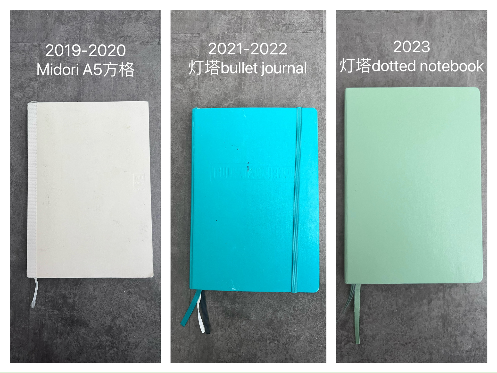
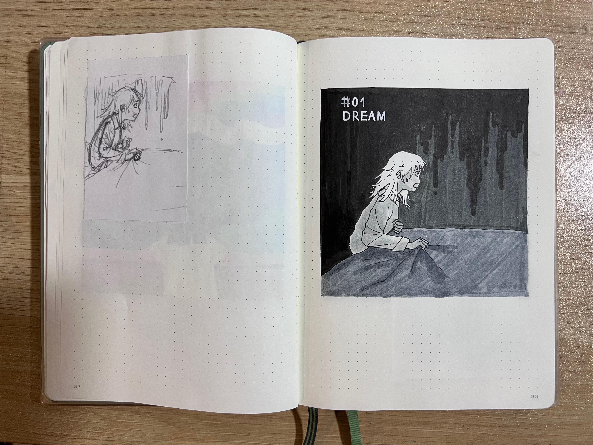
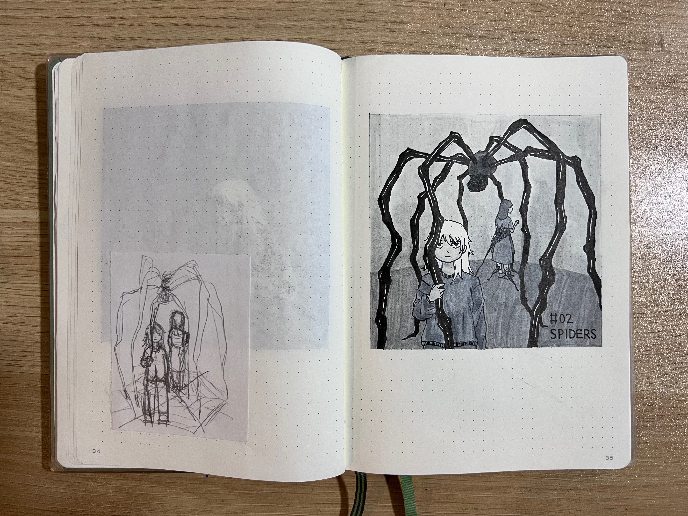
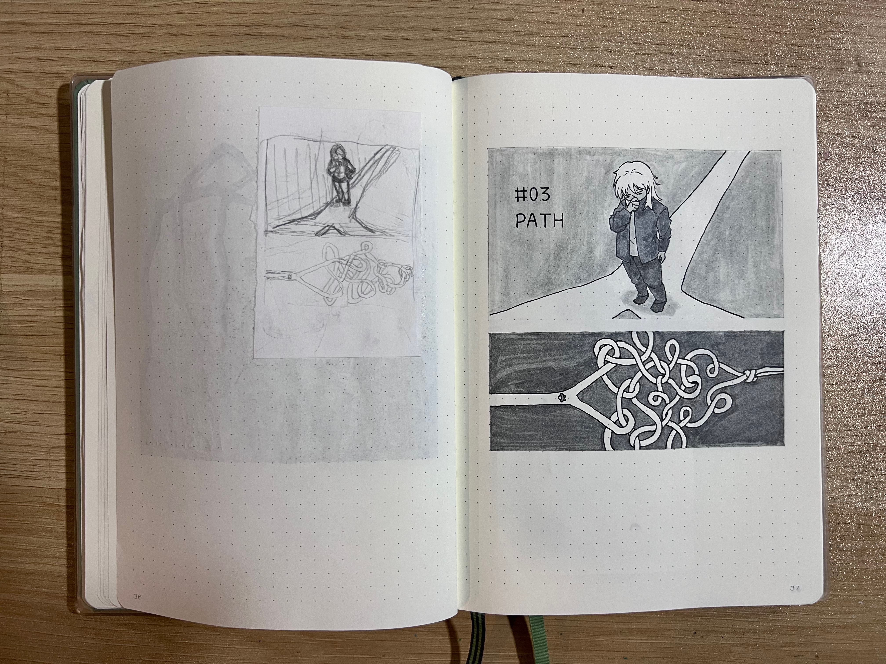
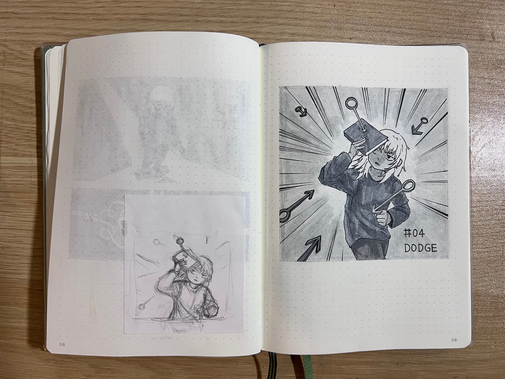
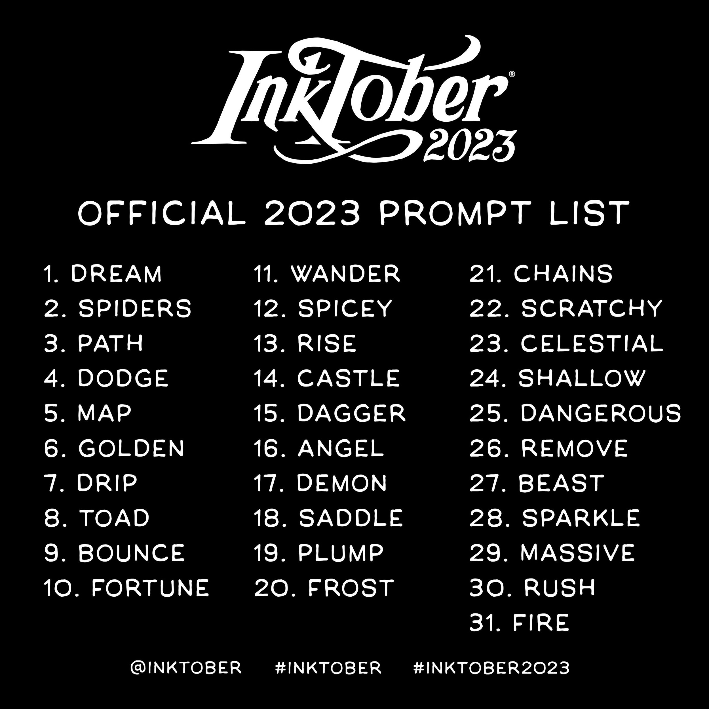
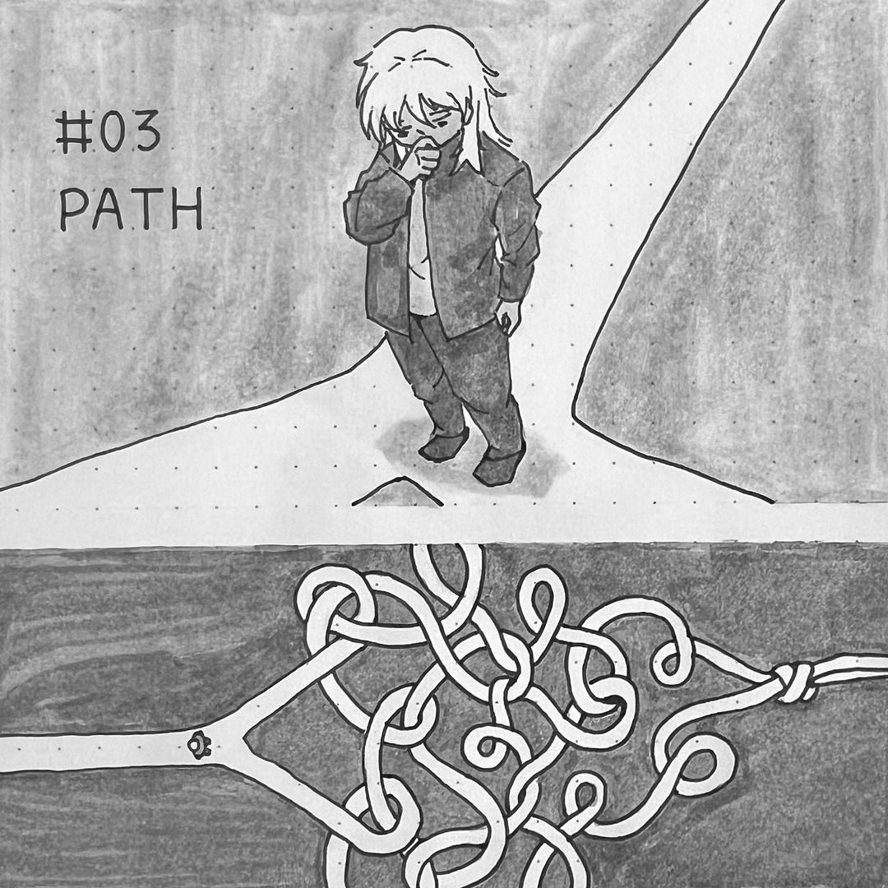
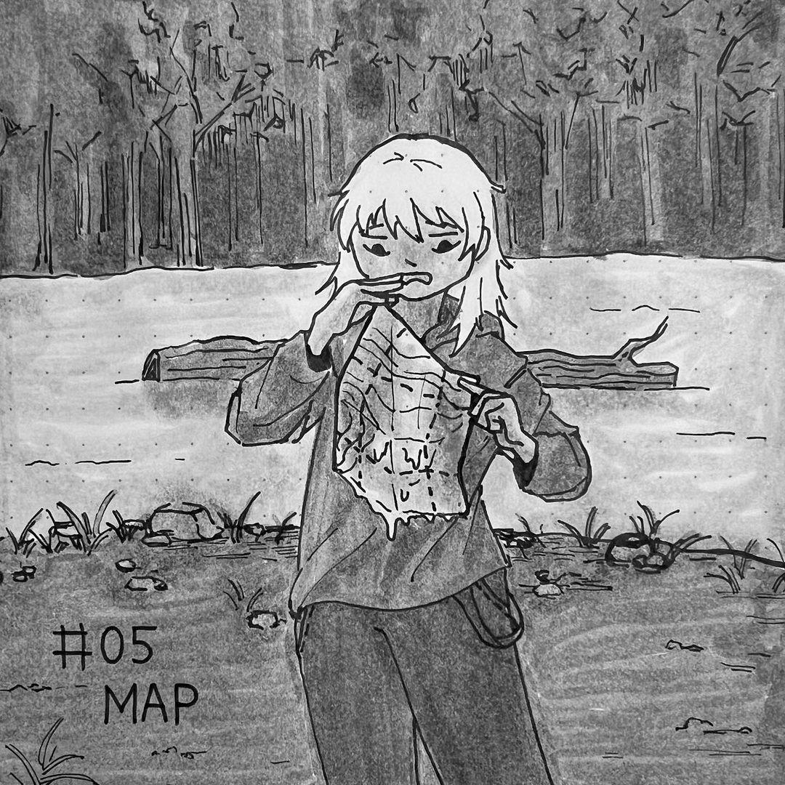
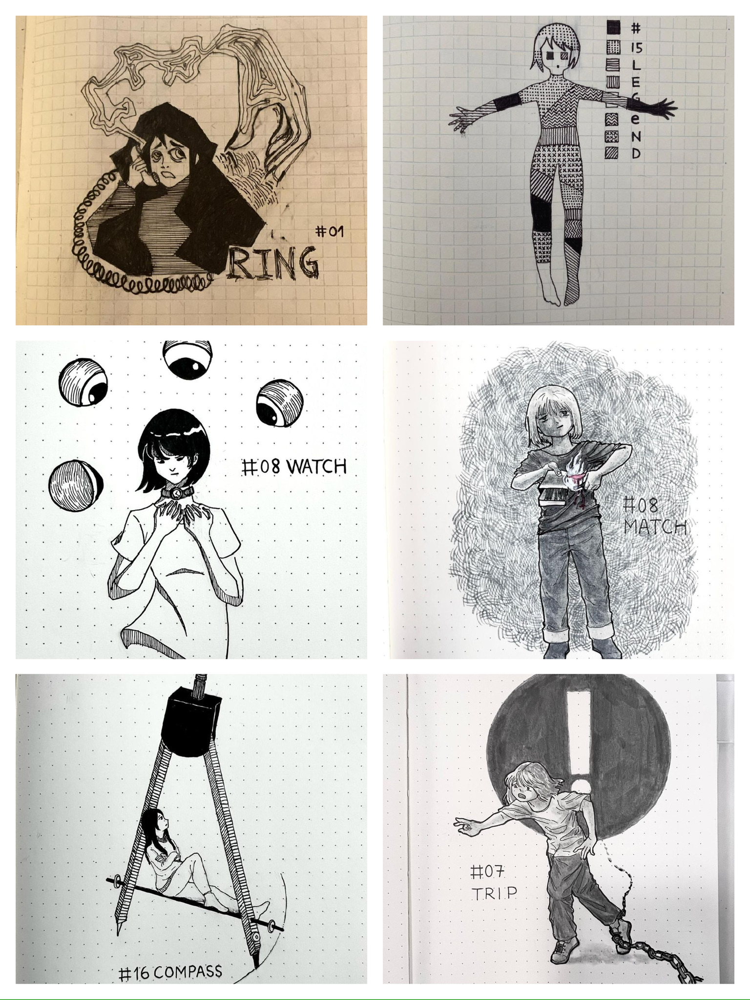
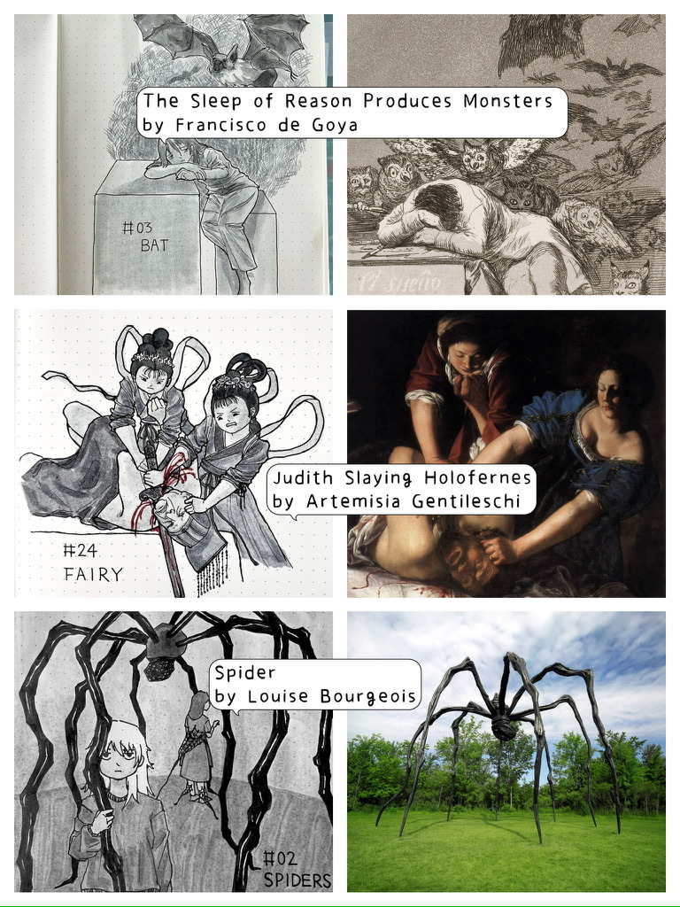

+++
title = "Inktober第五年"
summary = " "
image = "images/logo.jpeg"
categories = [
    "焚画炉",
]
tags = [
    "日常",    
    "创作",                         
]
date = "2023-10-06"
menu = "main"
+++
### 回顾

作为一个生活得极其糊弄，不喜欢计划也不喜欢复盘的人，不论是学生、社畜还是无业游民时期都时常觉得时间没有“刻度”，今天和昨天、今年和去年好像都没有什么分别。但最近为了搞portfolio网站去整理以往的作品时，发现参与[Inktober](https://inktober.com/)这个活动到今年竟然已经是第五年，之前每个十月的31张命题创作不论是digital还是physical record也还完整地保留着，每一年的画风和思路似乎都有所改变，不知不觉中也成为了一种生活和变化的记录——

- [2019（其实大部分是2020年补画的）](https://liminalnegativespace.xyz/tags/inktober2019/)
- [2020](https://liminalnegativespace.xyz/tags/inktober2020/)
- [2021](https://liminalnegativespace.xyz/tags/inktober2021/)
- [2022](https://liminalnegativespace.xyz/tags/inktober2022/)
- [2023（更新中）](https://liminalnegativespace.xyz/tags/inktober2023/)

这几年的风格变化还是挺明显的——2019到2020年“脑洞”比较大，每一张之间也没有特别统一的风格；2021年是改变比较大的一年，可能是因为当时同时也在参加一个60天速写练习的活动，对人物的画法开始逐渐稳定下来，Inktober的作品也变成偏写实的人物为中心的插画；2022年开始画一些类似[clog](https://liminalnegativespace.xyz/tags/%E7%B2%BE%E7%A5%9E%E5%9E%83%E5%9C%BE%E5%A1%AB%E5%9F%8B%E5%9C%BA/)（日常漫画，和blog、vlog相对）的东西，加上这几年积累了许多“生活意见”，对表达的需求日益增长，所以Inktober的创作思路也从装饰性转成了故事性；2023年除了打算统一画面大小和人物形象之外，与2022年应该不会有太大变化。

### 工具

虽然Inktober的发起人在规则中说要用ink来进行创作，但如果只是自娱自乐，不追求被官方feature之类的，其实不需要那么严格，用自己习惯的媒介就好，甚至不一定要是手绘。

我的工具：

至于本子，因为觉得白纸反而会不知道从何下笔，所以我一般会选择方格或者点阵笔记本，也方便控制画面尺寸：

### 过程

过程其实也很简单，无非就是构思→铅笔草稿→勾线→擦除草稿→上色。为了保持最终画面的相对干净，我会先在一个便携式速写本上画一个最初的小稿，这样也方便尝试不同的构思和构图，确定好之后再在本子上画铅笔稿。
<figure>
    
    <figcaption>专门画草稿的速写本</figcaption>
</figure>

<figure>
    
    <figcaption>草稿→铅笔稿→成稿</figcaption>
</figure>

今年决定把每次的小稿剪下来，贴在成稿的对面作为对比：

由于小稿阶段主要是为了确定主题和内容，不会太注意画面的比例，所以成稿变为正方形画面的时候构图有时也会发生一些改变。因为我本来就没有经过什么绘画基本功的训练，也不是很有耐心去找参考，所以当尺寸放大，结构清晰后那种成稿怎么看都不如草稿顺眼的情况也时有发生，但我是不会重画的😂（可能就像小时候看着还不错的孩子长大后变成“废物”一样，也是没办法的事hhh···

### 思路

Inktober是命题创作，名词、动词、形容词都有，有些甚至不能算“词”（比如2022年的uh-oh···），所以必然有些题目比较直观，另一些比较抽象。
<figure>
    
    <figcaption>今年的题目</figcaption>
</figure>
一般来说我的思路是把这个词所代表的物品、动作或状态放到一个能与人物产生关系的情景中，再把这个场景画出来。而我想到的情景大部分时候表达的都是偏向阴暗或讽刺的主题，拿今年刚画的两张作例子：

> path(道路)→
>
> “人生的分叉路”，但到这里好像没什么新意→
>
> 人生很多时候纠结了半天，其实选哪条路最后结果都大差不差→
>
> 最终构思：分叉路口犹豫不决的人，和俯瞰之下其实最后打结在一起的两条路
>
> 

> map(地图)→
>
> 野外露营需要地图→
>
> 不可能这么顺利，一定会出现突发情况！→
>
> 最终构思：河岸边拿着被水浸湿的地图不知所措的人
>
> 

除此之外，根据题目本身的性质，还有很多可以发掘灵感的角度——

比如 **同义词** （选择比较反直觉的释义或把多个意思结合在一起）：
<figure>
    
    <figcaption>ring（圆环/铃声），legend（传奇/图例），watch（手表/监视），match（比赛/配对/火柴），compass（指南针/圆规），trip（旅行/绊倒）</figcaption>
</figure>

或者 **艺术作品**：
<figure>
    
</figure>

还有 **文学、戏剧、影视**：
<figure>
    
</figure>

以及 **社会现实** （过不了审版）：
<figure>
    
</figure>