+++
title = "西雅图（部分）独立书店图鉴"
summary = " "
image = "images/title.jpeg"
categories = [
    "焚画炉",
    "戒读所",
]
tags = [
    "读书",
    "创作",
    "日常",                         
]
date = "2023-12-07"
menu = "main"
+++

<iframe src="https://www.google.com/maps/d/u/0/embed?mid=1V8kbx8QxHybr0-N-yMizDc-lTwmJ4bk&ehbc=2E312F&noprof=1" width="100%" height="360"></iframe>

书店可能是我平常最常去的地方了，去其他城市时也会想去看看当地有趣的书店。夏天的时候偶然发现西雅图每年有个<a href="https://www.seattlebookstoreday.com/" target="_blank">Seattle Independent Bookstore Day</a>的打卡活动，因为觉得太麻烦了我并没有参加，但是从那时候开始就一直想用画画的方式记录一下自己去过的独立书店，然而一直拖延着，在准备离开这个城市（和国家）的时候才终于把这个project完成了···

本来考虑过用类似钢笔淡彩的手绘风格，但因为想要尝试一些更有趣的、不那么写实的形式就用了像素画，想要制造一种“游戏地图”的感觉。虽然最后好像还是回到“抄照片”了，但还是一个挺有意思的尝试，毕竟之前没有怎么画过像素画。

这里只选了我自己去过的书店，更全面的西雅图的独立书店介绍可以看<a href="https://www.seattlemet.com/arts-and-culture/a-guide-to-independent-bookstores-in-seattle" target="_blank">这篇文章</a>。

### Elliott Bay Book Company
 <!-- begin columns block -->
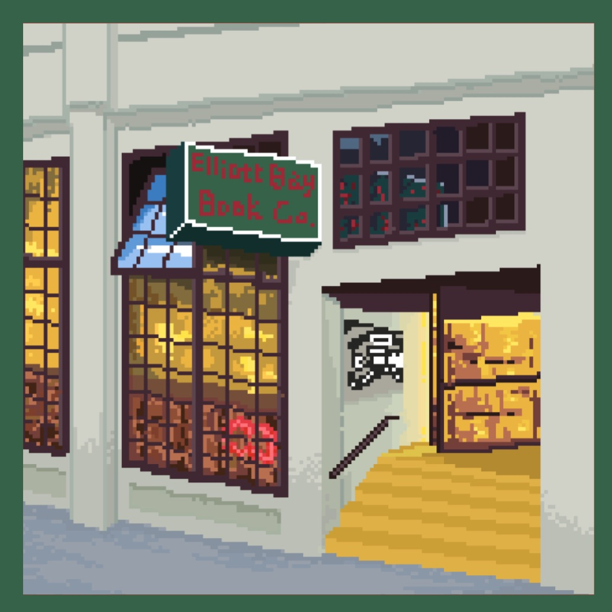
<---> <!-- magic separator, between columns -->
最常去的一家书店，甚至几年前搬来西雅图时选择现在这个公寓其中的一个原因就是周边的这家书店。店里除了书还会卖一些文创。

在这家店买书，结账的时候店员一般会在每一本里面都夹一张印有书店logo和一句作家quote书签（数了一下我已经有近80张了···）。有一次在上面看到了署名鱼玄机的诗，*Evening, page by page, I hum beneath my quilt*，查遍了鱼玄机现存的所有诗作发现是这首《和友人次韵》：

> 何事能销旅馆愁，红笺开处见银钩。
>  
> 蓬山雨洒千峰小，嶰谷风吹万叶秋。
>  
> 字字朝看轻碧玉，**篇篇夜诵在衾裯**。
>  
> 欲将香匣收藏却，且惜时吟在手头。

店里还有一家咖啡馆，在新冠爆发前还需要去office上班的时候，有时下班后不想马上回家就会去里面待一会，2022年成为无业游民之后更是经常去这家咖啡馆看书或者画画。今年明显感觉到工作时间咖啡馆里的客人数量增多了，不知道是不是因为裁员潮，不上班的人也增多了···



### Twice Sold Tales
 <!-- begin columns block -->
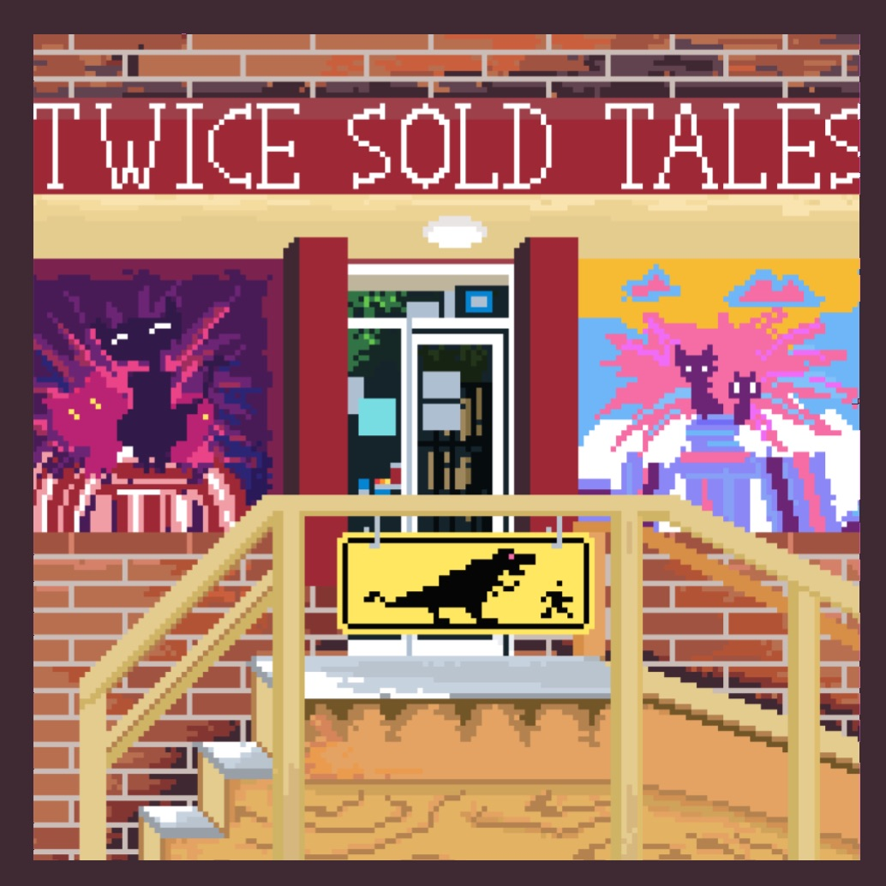
<---> <!-- magic separator, between columns -->
位于Capitol Hill的一家旧书店。像是民宅改造的，可以看出内部有许多房间，墙面几乎都被书架占满了所以过道很窄，在里面穿行有种走迷宫的感觉。

记得这家店有一位很博学的店员奶奶，基本总能根据顾客结账时手上的书和聊上几句。有次还听到她和一个香港裔的顾客讲一本关于文革的书。

猫是这家店的特色，店里有很多只，大部分都很“圆润”😂之前还看到过一只17岁的猫，但最近几次去都没有见到了···


### Ada's Technical Books and Cafe
 <!-- begin columns block -->
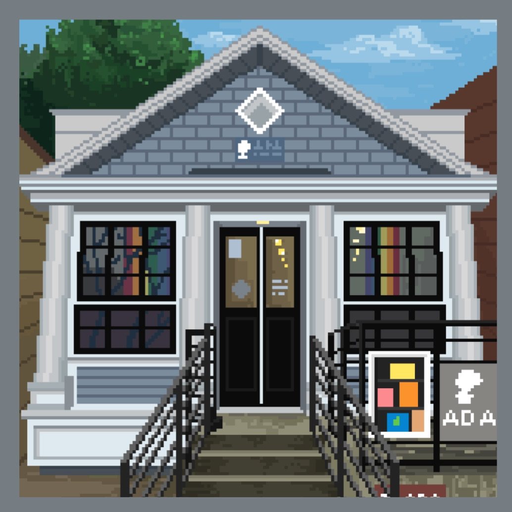
<---> <!-- magic separator, between columns -->
店名和logo来自Ada Lovelace，主要卖的也是科技类的书籍。店里也有个小咖啡馆，还有一个像自习室一样的小房间，里面有个可以坐大概六个人的桌子，周围书架上都是计算机相关的书（包括著名的O’Reilly“动物园”系列）。

画这张的时候第一次在画画中遇到app内保存失败，进度消失，只能重来的情况，可能果然和计算机行业八字不合吧😂···



### Nook & Cranny Books
 <!-- begin columns block -->
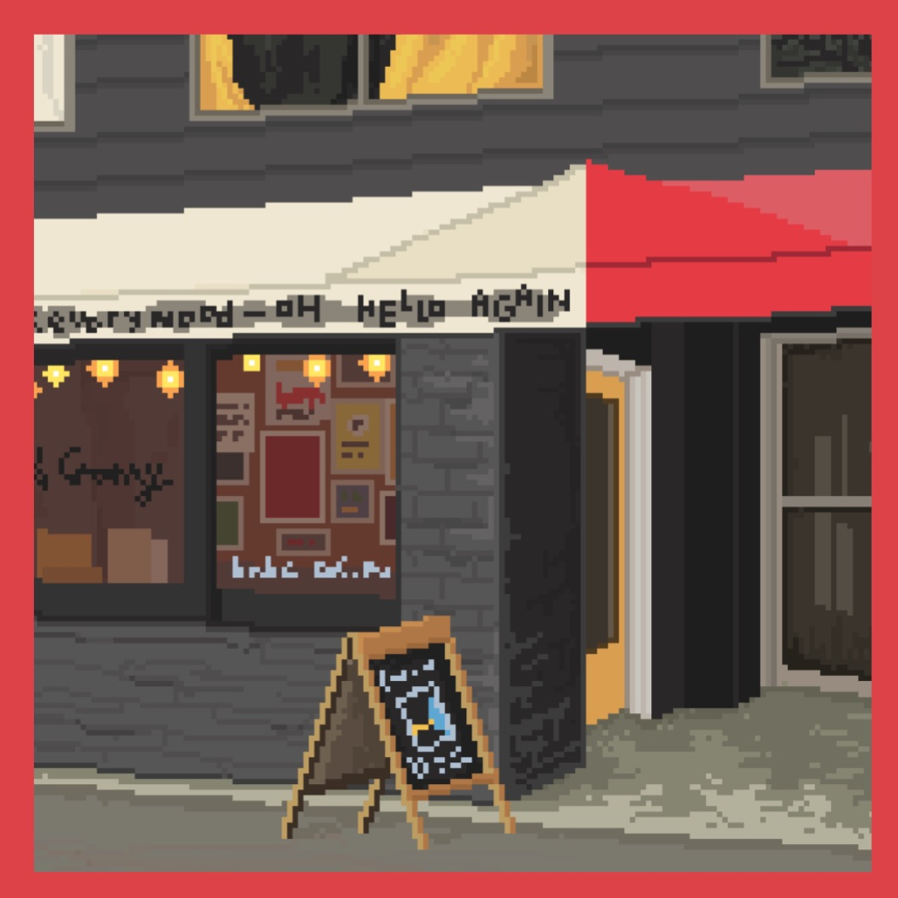
<---> <!-- magic separator, between columns -->
位于Capitol Hill，和上面的Ada's离得很近。店面比较小，里面有新书也有一些旧书，除此之外还有一些明信片和手工艺品。



### Horizon Books
 <!-- begin columns block -->
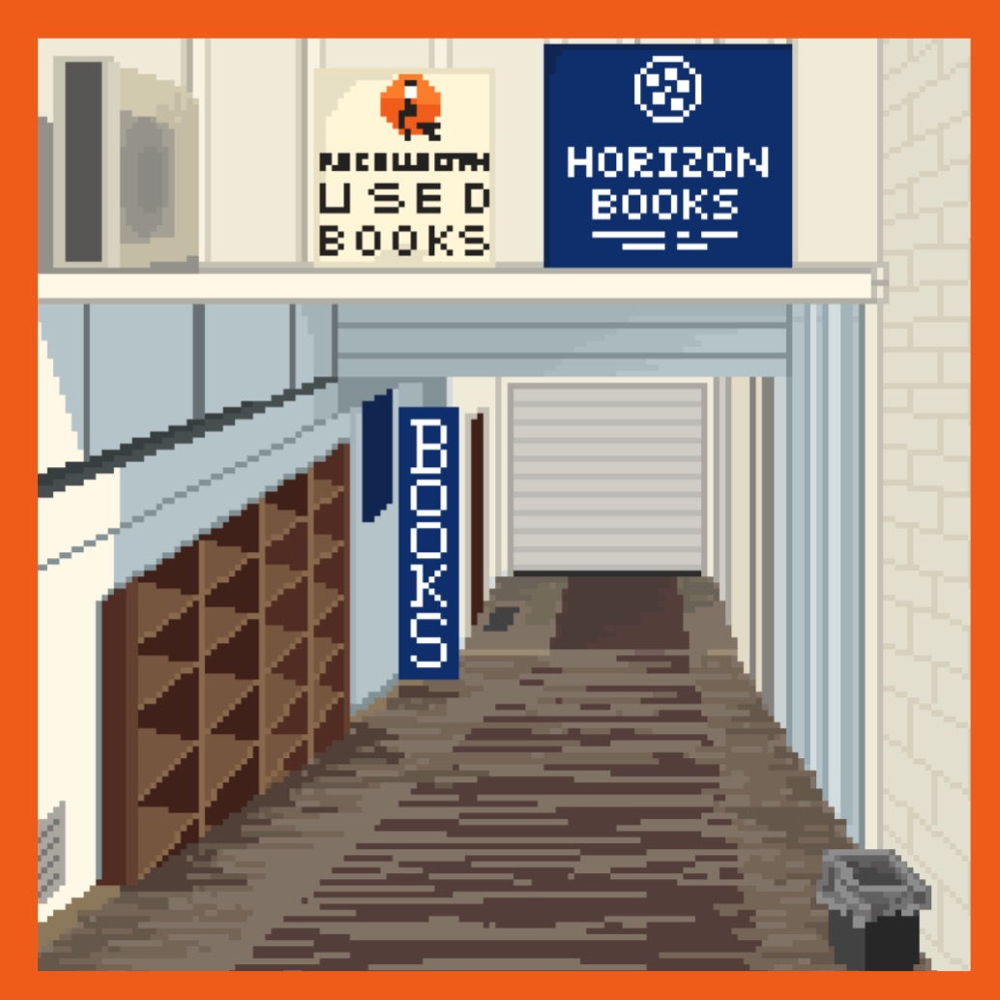
<---> <!-- magic separator, between columns -->
Capitol Hill一家位于地下的旧书店，但现在似乎已经停业了，最近路过时看到门口的书架上还零星放着几本书···


### Mercer Street Books
 <!-- begin columns block -->
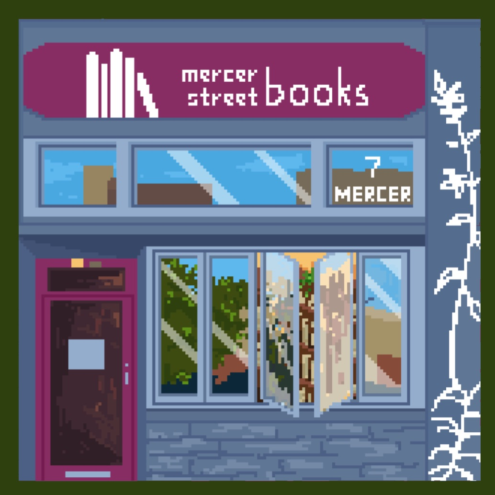
<---> <!-- magic separator, between columns -->
位于Queen Ann的旧书店，离SIFF影院很近，所以总是在看电影的前后去逛一下。在这家买过的主要是一些人文领域的书（艺术史 、人类学、性别研究等等）。

店里的环境比其他的旧书店要整洁一些，屋顶上挂着许多绿植，书架上还能看到一些形态有趣的书立。


### Magus Books
 <!-- begin columns block -->
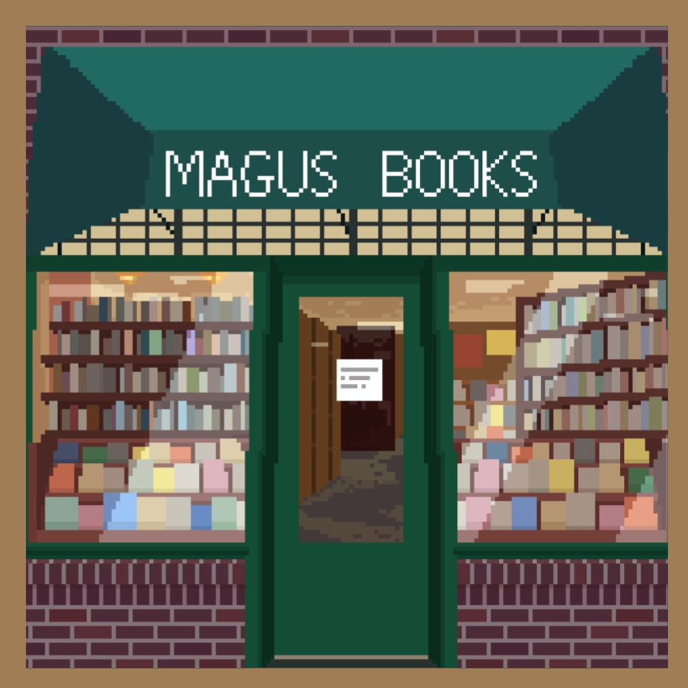
<---> <!-- magic separator, between columns -->
UW大学城里的旧书店，同样被书塞得很满。

店里有一面墙几乎都是和艺术相关的书籍，其中有很多很便宜的art monograph，[这篇文章](/posts/art-herstory)最后提到的画集就是在这里买的。


### Ophelia's Books
 <!-- begin columns block -->
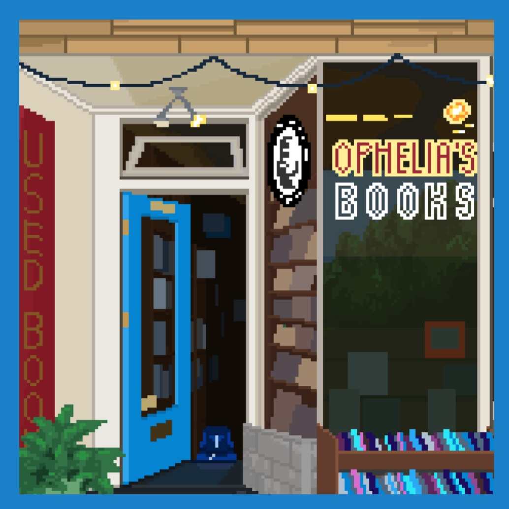
<---> <!-- magic separator, between columns -->
位于Fremont的旧书店，去的次数并不多。记得里面有一个很陡的螺旋阶梯，一部分空间位于地下。

另外还记得边上有一家唱片店和一家还不错的泰国餐馆。


### Left Bank Books Collective
 <!-- begin columns block -->
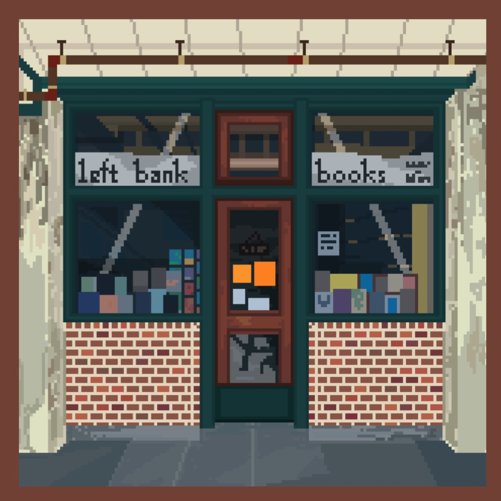
<---> <!-- magic separator, between columns -->
位于Pike Place Market的入口附近，店如其名，是一家“左派”书店。里面可以找到很多社会运动、马克思主义、无政府主义相关的书籍，还有本地的社群或个人制作的一些zine。



### Arundel Books
 <!-- begin columns block -->
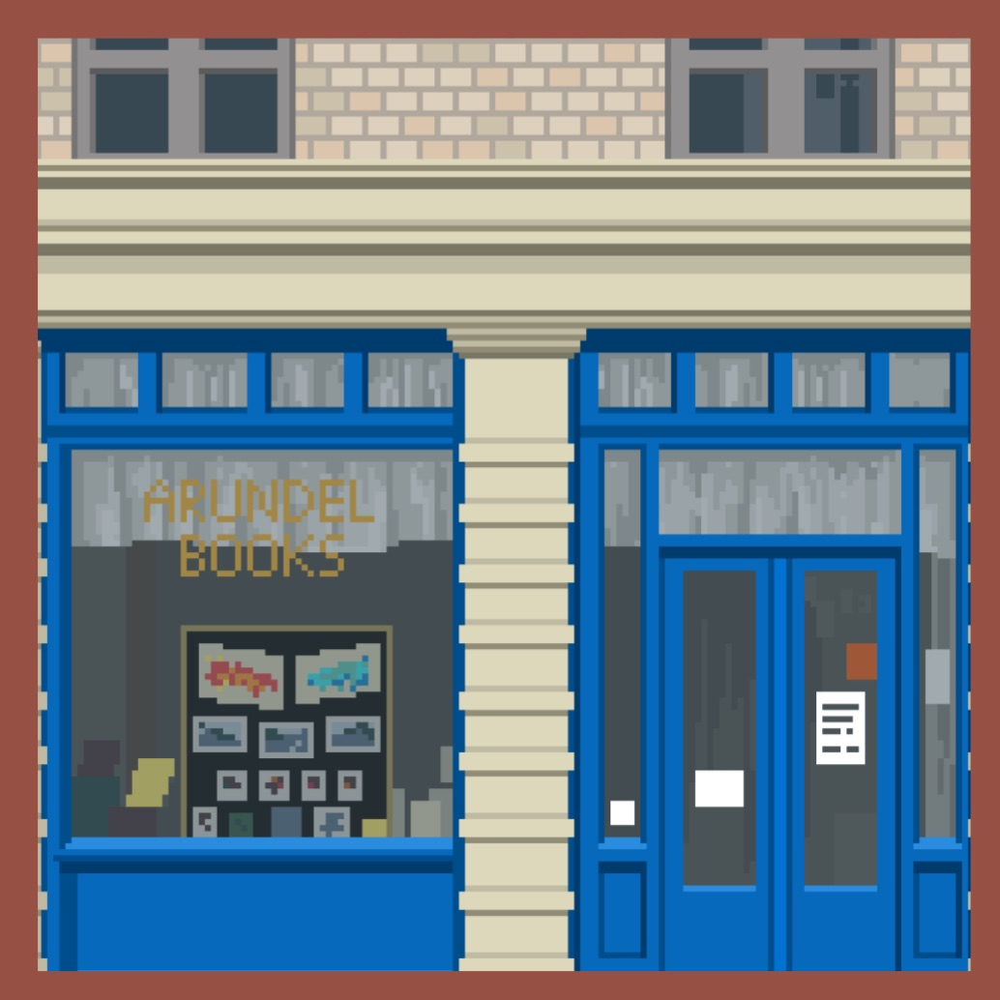
<---> <!-- magic separator, between columns -->
这家书店在Pioneer Square附近，内部建筑风格很华丽，有着像欧式教堂一样的穹顶和立柱，还有一个需要请示店员才能进去的古籍区。另外店里也会售卖一些local artist的作品。


### Open Books A Poem Emporium
 <!-- begin columns block -->
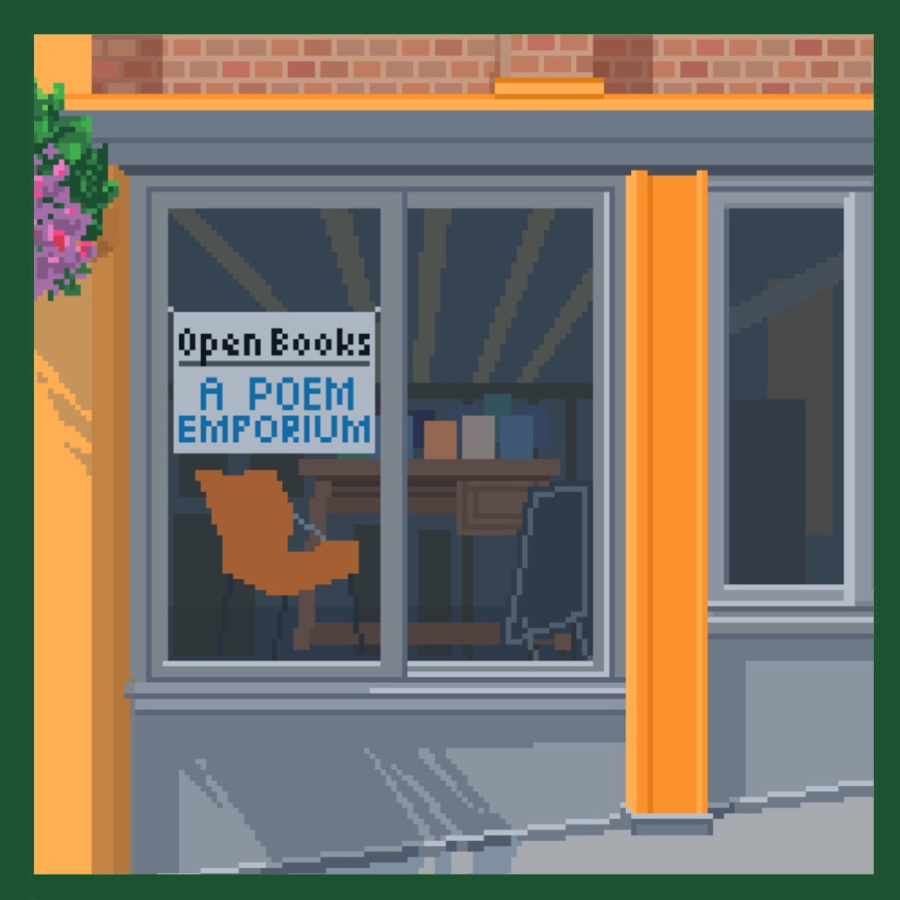
<---> <!-- magic separator, between columns -->
同样位于Pioneer Square附近，主要经营诗集。比起其他书店的poetry section，这里可以找到更多当代年轻诗人的作品，以及包括中文作者在内的非英语作家的英文译本。
